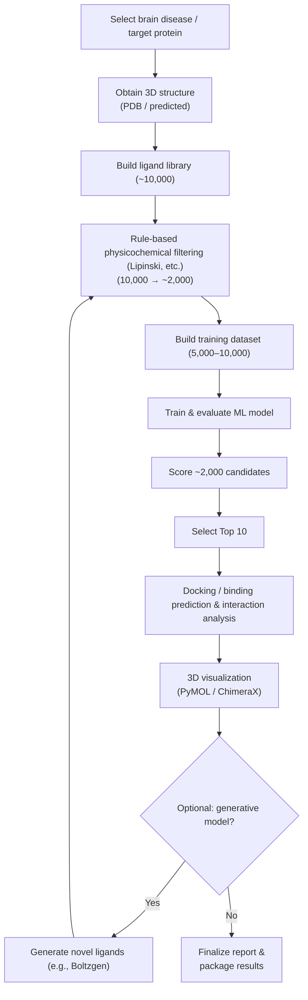

# neuro-ligand-discovery-pipeline
An end-to-end in silico pipeline for brain-disease target ligand discovery using Lipinski Ro5 filtering, ML-based ranking, and docking with 3D visualization.

## Overview (TL;DR)
Given a **brain-disease–related target protein**, this project builds a **~10,000-compound ligand library**, applies **physicochemical rule-based filtering** (down to **~2,000**), ranks candidates with a **machine-learning predictor**, selects **Top 10** ligands, and then performs **structure-based binding prediction (docking) and 3D visualization** for verification.

- Proposal (KO, PDF): [docs/proposal-ko.pdf](docs/proposal-ko.pdf)
- Proposal (KO, DOCX): [docs/proposal-ko.docx](docs/proposal-ko.docx)
  *English version coming soon.*

---

## Problem Statement
The chemical search space is extremely large, making it costly and time-consuming to identify **drug-like ligands** with high likelihood of binding/efficacy for a given target.

---

## Objectives
1. Select **one brain disease** and **one target protein** (with rationale) and obtain a 3D structure (PDB or predicted structure).
2. Build a ligand library (~10,000) and apply rule-based filtering (10,000 → ~2,000).
3. Construct a training dataset (~5,000–10,000) and train a binding/activity prediction model.
4. Score ~2,000 candidates and select **Top 10** ligands.
5. Perform docking/binding prediction and 3D visualization for the Top 10 protein–ligand complexes.
6. (Optional) Generate novel ligands with a generative model and re-run the same pipeline.

---

## Scope / Out of Scope
- **In scope:** in silico screening, prediction, docking, visualization, and evidence gathering from public datasets/literature  
- **Out of scope:** wet-lab synthesis and **in vitro / in vivo** experiments

---

## Pipeline
End-to-end flow:

---

## Data & Resources Plan

### Ligand Library (~10,000)
- Collect SMILES/SDF from public compound databases
- De-duplicate, standardize (tautomers/salts), and canonicalize structures

### Training Dataset (5,000–10,000)
- Collect binding/activity labels for the target protein (IC50/Ki/EC50, etc.)
- Normalize to a consistent scale and define the task as:
  - classification (thresholded active/inactive), and/or
  - regression (predict activity values)

### Protein Structure
- Prefer experimental structures from PDB  
- If unavailable, use predicted structures (e.g., AlphaFold-derived models)
- Define binding site via co-crystallized ligands, pocket prediction, and/or literature evidence

---

## Methods

### 1) Rule-based physicochemical filtering
- Apply **Lipinski’s Rule of Five** as a baseline:
  - MW ≤ 500
  - logP ≤ 5
  - HBD ≤ 5
  - HBA ≤ 10
- (Optional) Add Veber (TPSA/rotatable bonds), PAINS, and toxicity alerts

### 2) Molecular representations & preprocessing
- Morgan/ECFP fingerprints, physicochemical descriptors, and (optional) GNN-ready inputs
- Consider leakage-resistant splitting strategies such as **scaffold split**

### 3) ML training & candidate ranking
- Baselines: Logistic Regression, Random Forest, (optional) XGBoost/LightGBM
- (Optional) Deep learning: MLP, GNN (GCN/GAT), molecular Transformers
- Score ~2,000 candidates and select **Top 10**

### 4) Structure-based binding prediction (docking) & 3D visualization
- Dock the Top 10 to obtain binding poses/scores  
  - e.g., Boltz-2 or AutoDock Vina
- Summarize key interactions (H-bonds, hydrophobic contacts, etc.) and visualize complexes (PyMOL/ChimeraX)

### 5) (Optional) Generative modeling for novel ligands
- Use a generative model (e.g., Boltzgen) to propose new candidates
- Re-run **filtering → ML scoring → docking** iteratively

---

## Evaluation & Verification Plan

### Model metrics
- Classification: ROC-AUC, PR-AUC, F1, Precision/Recall (especially Top-k)
- Regression: RMSE/MAE, Pearson/Spearman
- (If applicable) ranking: Enrichment Factor (EF), BEDROC

### Verification strategy
- Compare random split vs scaffold split
- If known ligands exist, perform re-docking as a sanity check for docking settings
- Reproducibility: fixed seeds, versioned configs, and experiment logging

---

## Timeline & Milestones (example: 8 weeks)

| Week | Work | Deliverable |
|---|---|---|
| 1 | Finalize disease/target, obtain structure, define binding site | Rationale + structure files |
| 2 | Collect/standardize ligand library, build property pipeline | Clean library + scripts |
| 3 | Apply filtering (10k → ~2k) | Candidate list + summary stats |
| 4 | Collect/clean training data, generate features | Dataset v1 |
| 5 | Train/evaluate baselines | Metrics table + model artifacts |
| 6 | Score candidates and select Top 10 | Top 10 list + justification |
| 7 | Docking and 3D visualization | Docking outputs + figures |
| 8 | (Optional) generative loop + final packaging | Final report + packaged results |

---

## Deliverables
- Code repository (data collection/cleaning, filtering, training/evaluation, ranking, docking automation)
- Data (clean library, training dataset, candidate/result CSVs)
- Models (trained model files + reproducible configs)
- Results (Top 10 summary + docking/interaction analysis + 3D visuals)
- Documentation (proposal, final report, optional slides)

## References
- Lipinski CA et al. (2001)  
- RDKit (cheminformatics)  
- Protein Data Bank (PDB)  
- ChEMBL (bioactivity database)
